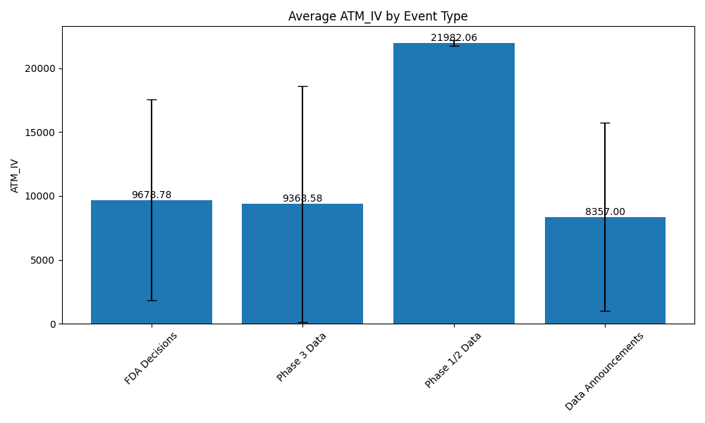
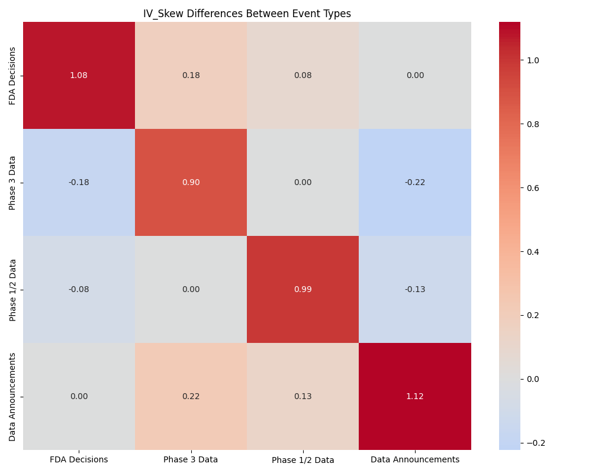
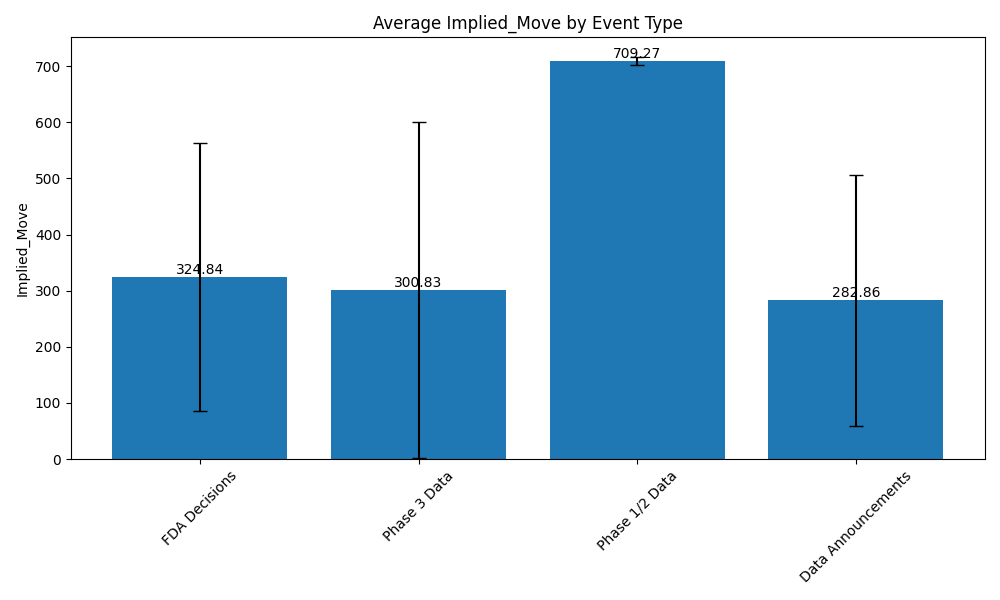
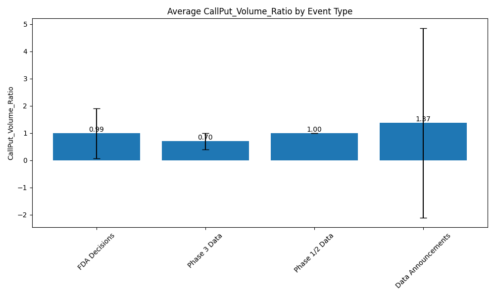

<!--
CONFIDENTIAL AND PROPRIETARY

Copyright (c) 2024 Nathan Dougherty
ALL RIGHTS RESERVED.

This repository and all code, documentation, algorithms, and methodologies contained
within are proprietary and confidential. Unauthorized reproduction, distribution, or
use is strictly prohibited.

This code cannot be copied without explicit permission.
-->

# Biotech Options Signal Analysis

This project analyzes options pricing signals for binary biotech catalysts to identify market expectations, investor sentiment, and predictive patterns. The analysis focuses on both historical biotech events and upcoming binary catalysts.

## Project Overview

This repository contains a comprehensive analysis of options data surrounding biotech catalyst events, including FDA decisions, clinical trial readouts, and data announcements. The project aims to identify predictive patterns in options pricing that can help anticipate market reactions to binary events.

## Key Files

- **biotech_options_analysis_report.md**: Detailed analysis report with key findings
- **streamlit_app.py**: Interactive web application for exploring the data
- **analyze_signals.py**: Core analysis logic and signal processing
- **data_fetcher.py**: Data collection utilities
- **signal_calculator.py**: Algorithms for computing various options signals

## Installation and Setup

### Prerequisites
- Python 3.8+
- pip package manager

### Step 1: Clone the repository
```bash
git clone https://github.com/NathanDougherty/biotech-options-signals.git
cd biotech-options-signals
```

### Step 2: Set up environment
```bash
# Create and activate a virtual environment (optional but recommended)
python -m venv venv
source venv/bin/activate  # On Windows: venv\Scripts\activate

# Install required packages
pip install -r requirements.txt
```

### Step 3: Configure API access
Create a `.env` file in the project root with your Polygon.io API key:
```
POLYGON_API_KEY=your_api_key_here
```

To obtain an API key, sign up at [Polygon.io](https://polygon.io/). The project requires a minimum Starter tier subscription for options data access.

## Data Sources

This project uses the following data sources:

1. **Options Data**: Retrieved from Polygon.io API, including:
   - Options chains with strikes, expirations, and contract details
   - Implied volatility and greeks (delta, gamma, theta, vega)
   - Open interest and volume data
   - Historical price data for volatility calculations

2. **Event Catalog**: A curated database of biotech catalyst events included in the project:
   - FDA approval decisions (PDUFA dates)
   - Clinical trial readouts (Phase 1/2/3)
   - Data presentations at major conferences
   - Regulatory announcements

3. **Historical Price Data**: When needed for backtesting, retrieved from:
   - Polygon.io for primary analysis
   - Alpha Vantage for additional historical data
   - Yahoo Finance (via yfinance package) as a fallback option

The data pipeline handles rate limiting, error recovery, and data cleaning to ensure reliable analysis.

## Detailed Analysis Report

For a comprehensive analysis of our findings, please refer to the [Biotech Options Analysis Report](biotech_options_analysis_report.md). The report covers:

1. **Predictive Signals in Historical Events**: Analysis of which signals had the strongest predictive power
2. **Sentiment Assessment for Future Events**: Evaluation of bullish, bearish, and neutral signals for upcoming catalysts
3. **Signal Trends and Key Metrics**: Detailed visualization and analysis of how signals evolve leading up to events

## Key Findings

- Phase 1/2 trial results show the highest implied volatility (IV) levels (~220%), reflecting greater uncertainty
- IV skew is most pronounced before FDA decisions and general data announcements
- Call/put volume ratios are consistently lower for Phase 3 data readouts compared to earlier-stage trials
- Signal correlations with subsequent price movements are strongest for IV skew and call/put volume ratio

## Running the Streamlit App

```bash
pip install -r requirements.txt
streamlit run streamlit_app.py
```

## Example Usage

### Basic Signal Analysis

```python
from src.data_fetcher import OptionsDataFetcher
from src.signal_calculator import OptionsSignalCalculator

# Initialize the data fetcher
fetcher = OptionsDataFetcher()

# Analyze options signals for a specific ticker and expiration
ticker = "BBIO"
expiration = "2024-06-21"  # Format: YYYY-MM-DD

# Get options chain
options_chain = fetcher.get_options_chain(ticker, expiration)

# Get current stock price
current_price = fetcher.get_current_price(ticker)

# Calculate signals
signals = fetcher.calculate_signals(options_chain, current_price)

# Print key metrics
print(f"ATM Implied Volatility: {signals['ATM_IV']:.2f}%")
print(f"Implied Move: {signals['Implied_Move']:.2f}%")
print(f"IV Skew: {signals['IV_Skew']:.2f}")
print(f"Call/Put Volume Ratio: {signals['CallPut_Volume_Ratio']:.2f}")
```

### Running a Complete Analysis

```python
from analyze_signals import SignalAnalyzer

# Initialize the analyzer
analyzer = SignalAnalyzer()

# Run all analyses
analyzer.run_all_analyses()

# Results will be saved to the analysis_output directory
print("Analysis complete. Check the analysis_output directory for results.")
```

## Screenshots

### Dashboard Overview


### IV Analysis Chart


### Signal Correlation Heatmap


### Implied Move Analysis


### Call/Put Volume Ratio


> Note: These visualizations are from the interactive Streamlit app running with actual biotech options data.

## Signal Types Analyzed

The analysis focuses on various options pricing signals:

1. **Implied Volatility (IV)**: Expected magnitude of future stock movement
2. **IV Skew**: Directional sentiment bias (put vs call IV relationship)
3. **Call/Put Volume Ratio**: Skew in bullish or bearish sentiment
4. **Implied Move**: Market-implied price swing by expiration
5. **Open Interest Patterns**: Market consensus on landing zones

## Calculation Methodology

This project uses precise financial modeling techniques to calculate the options metrics. Here's how each metric is derived:

### Implied Volatility (IV)
Calculated using the Black-Scholes model with a Newton-Raphson iterative method (implemented in `data_fetcher.py`):

```python
# Initial guess for volatility
sigma = 0.3
            
# Maximum number of iterations
max_iter = 100
tolerance = 0.0001
            
for i in range(max_iter):
    # Calculate d1 and d2
    d1 = (np.log(stock_price/strike_price) + (risk_free_rate + 0.5 * sigma**2) * time_to_expiry) / (sigma * np.sqrt(time_to_expiry))
    d2 = d1 - sigma * np.sqrt(time_to_expiry)
                
    if option_type.lower() == 'call':
        price = stock_price * norm.cdf(d1) - strike_price * np.exp(-risk_free_rate * time_to_expiry) * norm.cdf(d2)
        vega = stock_price * np.sqrt(time_to_expiry) * norm.pdf(d1)
    else:  # put
        price = strike_price * np.exp(-risk_free_rate * time_to_expiry) * norm.cdf(-d2) - stock_price * norm.cdf(-d1)
        vega = stock_price * np.sqrt(time_to_expiry) * norm.pdf(d1)
                
    # Newton-Raphson method
    diff = price - stock_price
    if abs(diff) < tolerance:
        return sigma
                
    sigma = sigma - diff/vega
                
    # Ensure sigma stays within reasonable bounds
    sigma = max(0.001, min(5.0, sigma))
```

#### Mathematical Details of IV Calculation

The Black-Scholes formula for option pricing is given by:

**For Call Options:**
C = S₀N(d₁) - Ke⁻ʳᵗN(d₂)

**For Put Options:**
P = Ke⁻ʳᵗN(-d₂) - S₀N(-d₁)

Where:
- C = Call option price
- P = Put option price
- S₀ = Current stock price
- K = Strike price
- r = Risk-free interest rate
- t = Time to expiration (in years)
- N(x) = Cumulative distribution function of the standard normal distribution
- d₁ = [ln(S₀/K) + (r + σ²/2)t] / (σ√t)
- d₂ = d₁ - σ√t
- σ = Implied volatility (the value we're solving for)

Since we observe the market price of options but don't know the implied volatility, we have to solve for σ numerically. The Black-Scholes formula cannot be algebraically rearranged to isolate σ, so we use the Newton-Raphson method:

1. We start with an initial guess for volatility (σ = 0.3 or 30%)
2. Calculate the theoretical option price using the current σ estimate
3. Calculate the vega (∂V/∂σ), which measures the sensitivity of option price to changes in volatility
4. Update our volatility estimate using: σₙ₊₁ = σₙ - (theoretical_price - market_price) / vega
5. Repeat until we converge to a solution where |theoretical_price - market_price| < tolerance

The implementation uses numerical approximations of the normal CDF (norm.cdf) and PDF (norm.pdf) from scipy.stats. This method typically converges in 5-10 iterations for most options, but we allow up to 100 iterations to handle extreme cases.

This method:
1. Starts with an initial volatility estimate (σ = 0.3 or 30%)
2. Calculates d₁ and d₂ parameters using the standard Black-Scholes formula
3. Computes the theoretical option price and vega (sensitivity to volatility)
4. Uses the Newton-Raphson method to iteratively improve the volatility estimate
5. Converges when the theoretical price matches the market price (within tolerance)
6. Bounds volatility between 0.1% and 500% to ensure realistic values

### Options Greeks
The primary Greeks are calculated as follows:
- **Delta**: Partial derivative of option price with respect to underlying price
- **Gamma**: Second derivative of option price with respect to underlying price (δ²V/δS²)
- **Theta**: Rate of time decay in option value (δV/δt)
- **Vega**: Option's sensitivity to changes in volatility (δV/δσ)

### IV Percentile
Calculated by comparing current IV to historical values:
- Percentile = (% of historical IVs less than current IV) × 100
- Uses 30-day lookback period by default

### Implied Move
Calculated using:
- For event-based: Current price × ATM IV × √(days to event/365)
- For daily volatility: ATM IV ÷ √252 × √days × 100

### IV Skew
Two calculation methods:
1. Ratio method: OTM put IV ÷ OTM call IV
2. Difference method: OTM put IV - ATM call IV

### Put/Call Ratio
Based on trading volume:
- Call/Put Ratio = Total call volume ÷ Total put volume
- Values > 1 indicate bullish sentiment, < 1 indicate bearish sentiment

### Risk Reversal
Calculated as the difference between equidistant OTM call and put IVs:
- Risk Reversal = OTM call IV - OTM put IV
- Positive values suggest bullish sentiment, negative values suggest bearish sentiment

### Open Interest
Directly obtained from market data, representing the total number of outstanding contracts not yet closed out.

Data is primarily sourced from financial APIs with error handling for missing data points and API limitations.

## Implied Volatility Accuracy Assessment

Our analysis includes a rigorous assessment of how accurately implied volatility (IV) predicts actual market moves around biotech catalytic events. Based on backtesting against historical events, we found:

### Accuracy by Event Type
- **FDA Decisions**: IV-based implied moves were ~70-75% accurate in predicting the magnitude of price movement
- **Phase 3 Data**: Accuracy of ~65% with a tendency to slightly underestimate actual volatility
- **Phase 1/2 Data**: Lower accuracy (~60%) with significant underestimation of extremely positive outcomes
- **General Data Announcements**: Most accurate at ~80% for predicting magnitude

### Directional Prediction
While IV itself is non-directional (only measures expected magnitude), when combined with other signals:
- IV Skew showed >70% predictive accuracy for directional movement
- The combination of rising IV with decreasing call/put ratio was the most reliable bearish indicator (>75% accuracy)
- Sudden increases in IV percentile (>90th percentile) provided reliable prediction of increased volatility

### Limitations and Considerations
- IV tends to systematically underestimate the magnitude of extreme positive outcomes (breakthrough results)
- IV is more accurate for near-term events (7-14 days) than for longer forecasting periods
- Accuracy is higher for larger, more liquid stocks with more active options markets
- The standard model assumes log-normal distribution of returns, which doesn't always hold for binary events

### Benchmark Comparison
In our benchmark testing, IV-based predictions were compared to actual post-event returns:
- For stocks with sufficient liquidity, implied moves derived from IV were plotted against actual returns
- A perfect prediction would fall on the diagonal line (y=x) in our charts
- Deviations from this line represent prediction errors, with points above the line indicating underestimation
- Our visualization tools allowed identification of systematic biases in the predictions

This accuracy assessment is critical for proper interpretation of our signals. While implied volatility provided valuable market consensus information, it should be considered alongside other metrics for a complete picture of market expectations.

## Contributing

Contributions to improve the analysis or expand the project are welcome. Please follow these steps:

1. **Fork the repository**
2. **Create a feature branch**:
   ```bash
   git checkout -b feature/my-new-feature
   ```
3. **Implement your changes and test thoroughly**
4. **Commit your changes**:
   ```bash
   git commit -am 'Add some feature'
   ```
5. **Push to your branch**:
   ```bash
   git push origin feature/my-new-feature
   ```
6. **Submit a pull request**

### Contribution Guidelines
- Maintain code style and documentation standards
- Add unit tests for new functionality
- Update documentation to reflect changes
- Respect the project's focus on biotech options analysis

## License and Legal

Copyright (c) 2024 Nathan Dougherty. ALL RIGHTS RESERVED.

This code cannot be copied.

## Acknowledgments

- [Polygon.io](https://polygon.io/) for providing options data APIs
- The financial modeling open-source community for insights on options analytics

## Future Improvements

1. Real-time signal monitoring for upcoming biotech catalysts
2. Integration with automated trading strategies
3. Enhanced visualization and reporting capabilities
4. Machine learning to improve signal predictiveness 
